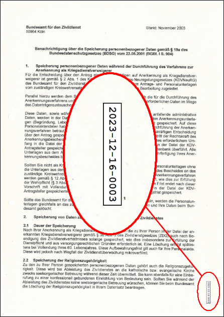

# stampdf

Stamp a short text string in the most suitable location onto every page of a PDF file.

`stampdf` requires Java to run but is otherwise a [fully self-contained shell script(ish)](https://github.com/pb-/stampdf/releases) without any other dependencies.


## Rationale

The primary use case for `stampdf` is to automatically add a short identifier (think document number) to each page of a document without obstructing the contents. This is useful when you send out documents that may get printed, annotated by hand, scanned, and sent back to you again (hello, 🇩🇪).

Picking the stamp location happens by ~using advanced AI models~ looking at the potential stamp regions and works even when the document consists of scanned imagery. The font size for the identifier is chosen in such a way that it is reasonably readable when the document is printed to fit on an ~A4 page, regardless of actual document dimensions.


## Example

In this example `2023-12-16-0003` was stamped onto the page and the best location for that was determined to be along the right edge, on the bottom.




## Download

You can get a pre-built "binary" [from the releases page](https://github.com/pb-/stampdf/releases).

```shell
curl -L https://github.com/pb-/stampdf/releases/download/0.9.0/stampdf -o stampdf
chmod a+x stampdf
```

Or your can build it yourself (needs Clojure and make):

```shell
make release
ls target/stampdf
```


## Usage

See `stampdf --help`; a possibly outdated version is reproduced below.

```
stampdf 0.9.0 -- stamp a short text string in the most suitable location onto every page of a PDF

usage: stampdf [OPTION]... INPUT-FILE TEXT

options:
  -i, --in-place         overwrite the input file, use with care
  -o, --output FILENAME  filename of the stamped output file
  -w, --overwrite        overwrite output file if it exists
  -h, --help

please file bugs at https://github.com/pb-/stampdf
```
